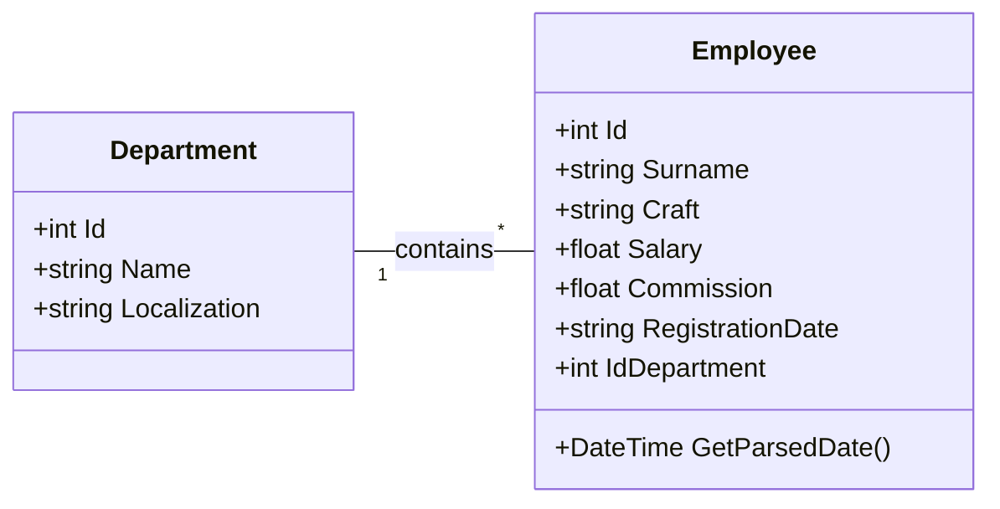
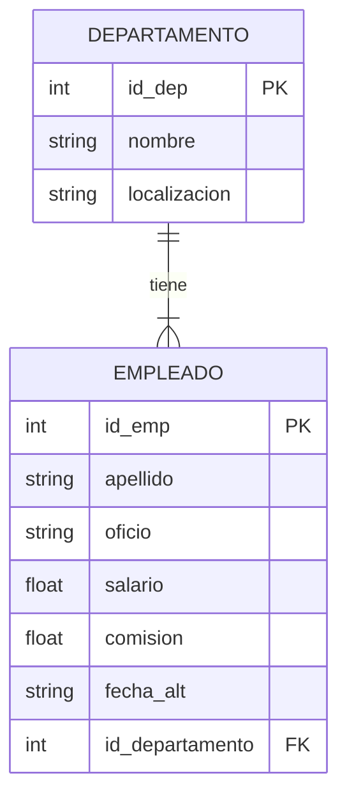

# Ejercicio Gestión de Empleados Modo Conectado
> Por: Alejandro del Valle Vallés

El ejercicio consiste en desarrollar una APP en **.NET MAUI** para **Windows** que permita gestionar los empleados de una empresa y realizar operaciones CRUD sobre ellos.

### Funcionamiento
La aplicación muestra una lista de departamentos; al seleccionar uno, se cargan los empleados pertenecientes a dicho departamento. 
* **Gestión de Empleados**: Al seleccionar un empleado, se cargan sus datos en el formulario para permitir su modificación, eliminación o duplicación. 
* **Transferencias**: Se puede cambiar el departamento de un empleado simplemente seleccionando un departamento distinto en la lista.
* **Creación**: Para dar de alta a un empleado, es obligatorio cumplimentar los campos siguiendo las reglas de negocio y asignar un departamento.
* **Búsqueda**: Incluye un sistema de filtrado dinámico para localizar empleados por cualquiera de sus atributos.

## UML
> El código está completamente en Inglés


## MER (SQLite)
> La estructura y columnas están en Español


## Query SQL para insertar datos de prueba
> Es importante ejecutar primero el programa para que se genere la BBDD.
La ruta en Windows es `C:\Users\(Tu Usuario)\AppData\Local\User Name\com.companyname.modoconectado\Data\Empleados.db3`

```SQL
INSERT INTO Departamento (nombre, localizacion)
VALUES ('Recursos Humanos', 'Madrid'),
('Finanzas', 'Barcelona'),
('IT', 'Valencia'),
('Marketing', 'Sevilla'),
('Ventas', 'Bilbao');

INSERT INTO Empleado (apellido, oficio, salario, comision, fecha_alt, id_departamento)
VALUES 
('García', 'Vendedor', 2500.50, 500.00, '15-01-2024', 1),
('López', 'Analista', 3200.00, 200.00, '20-02-2024', 2),
('Martínez', 'Director', 4500.00, 1000.00, '05-03-2024', 3),
('Sánchez', 'Vendedor', 2100.00, 450.00, '12-03-2024', 1),
('Pérez', 'Contable', 2800.75, 100.00, '01-04-2024', 4),
('Gómez', 'Operario', 1800.00, 50.00, '10-04-2024', 5),
('Rodríguez', 'Vendedor', 2300.00, 600.00, '22-04-2024', 1),
('Fernández', 'Analista', 3100.00, 250.00, '02-05-2024', 2),
('Moreno', 'Operario', 1750.50, 40.00, '15-05-2024', 5),
('Jiménez', 'Director', 4800.00, 1200.00, '01-06-2024', 3),
('Álvarez', 'Contable', 2900.00, 150.00, '10-06-2024', 4),
('Romero', 'Vendedor', 2200.00, 550.00, '18-06-2024', 1),
('Alonso', 'Analista', 3300.00, 300.00, '05-07-2024', 2),
('Gutiérrez', 'Operario', 1900.00, 60.00, '12-07-2024', 5),
('Navarro', 'Contable', 2750.00, 120.00, '01-08-2024', 4),
('Torres', 'Vendedor', 2400.00, 700.00, '15-08-2024', 1),
('Domínguez', 'Analista', 3400.00, 350.00, '02-09-2024', 2),
('Vázquez', 'Director', 5000.00, 1500.00, '10-09-2024', 3),
('Ramos', 'Operario', 1850.00, 45.00, '20-09-2024', 5),
('Gil', 'Vendedor', 2150.00, 480.00, '01-10-2024', 1),
('Ramírez', 'Contable', 3000.00, 200.00, '15-10-2024', 4),
('Serrano', 'Analista', 3250.00, 280.00, '05-11-2024', 2),
('Blanco', 'Operario', 1700.00, 30.00, '12-11-2024', 5),
('Molina', 'Director', 4600.00, 1100.00, '01-12-2024', 3),
('Morales', 'Vendedor', 2250.00, 520.00, '15-12-2024', 1),
('Suárez', 'Contable', 2850.00, 180.00, '20-12-2024', 4),
('Ortega', 'Analista', 3150.00, 220.00, '05-01-2025', 2),
('Delgado', 'Operario', 1950.00, 70.00, '15-01-2025', 5),
('Castro', 'Vendedor', 2350.00, 580.00, '01-02-2025', 1),
('Ortiz', 'Director', 4700.00, 1300.00, '10-02-2025', 3);
```